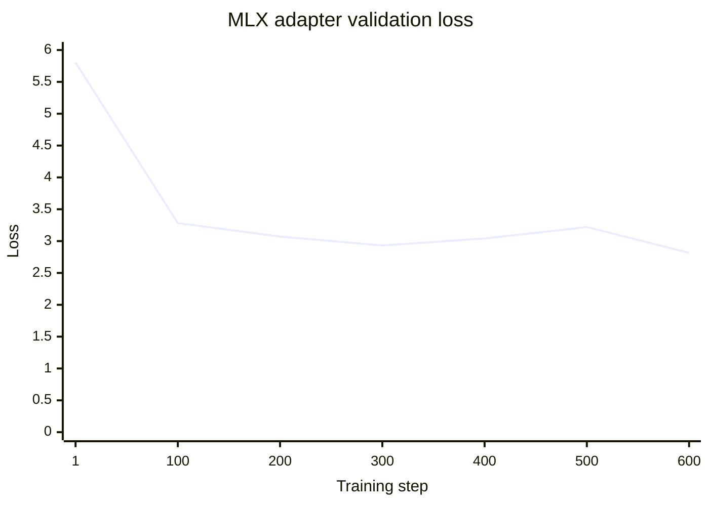
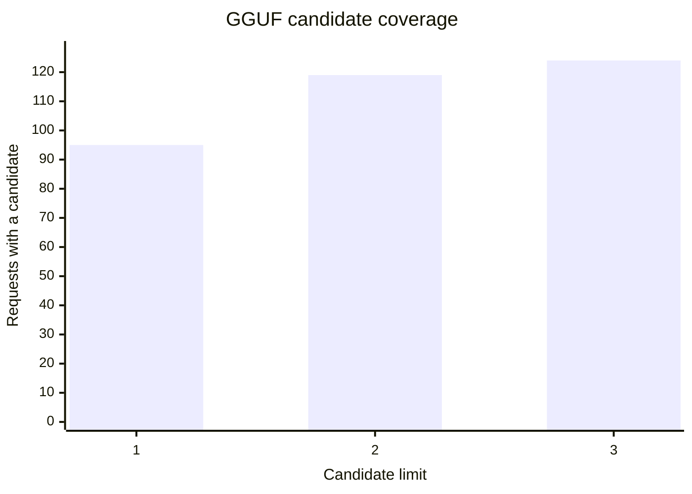
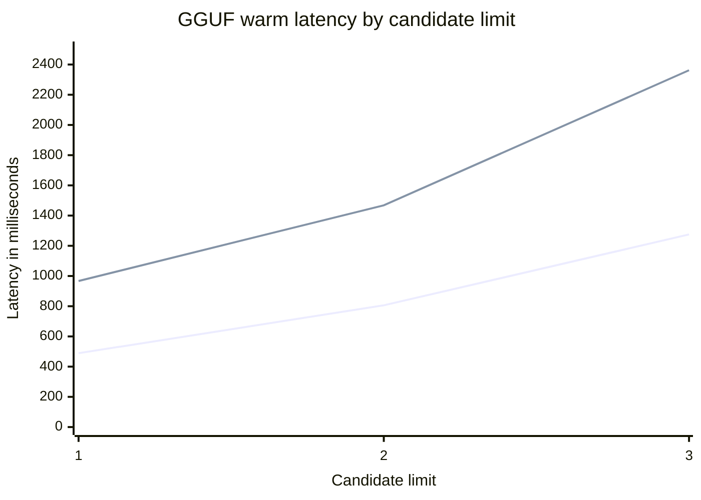
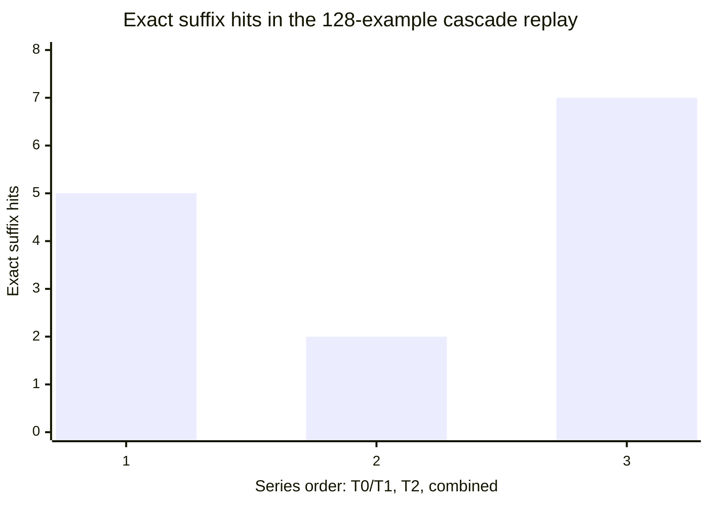
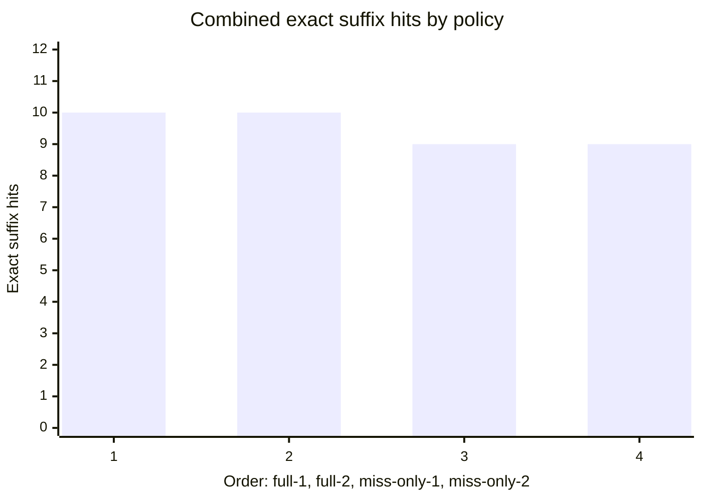
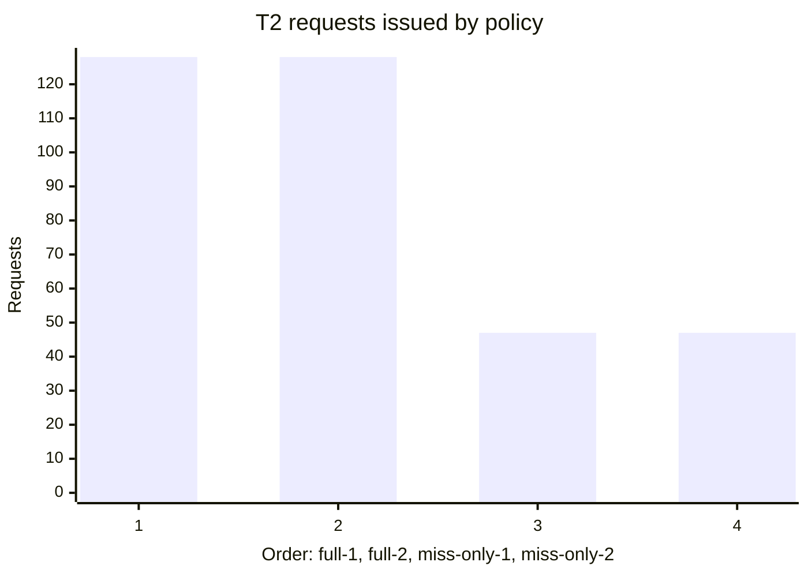

# Local T2 training and evaluation

**Training run:** 2026-09-29 · **Historical cascade:** 2026-09-30 · **Paired policy replay:** 2026-10-04
**Status:** exploratory; the trained adapter is not used by the terminal

## Summary

We exported local history, trained a Qwen3.5-0.8B MLX LoRA adapter, and scored
the MLX model and the terminal's GGUF path. The adapter had no exact completions
and produced fewer clean outputs than the base model, so the app does not use
it. The GGUF sweep led us to lower the default candidate count from three to
two: exact-match count stayed the same while latency fell.

The historical 2026-09-30 cascade replay found 7/128 combined exact suffixes
and 6 exact top suggestions. A fresh 2026-10-04 replay then compared both T2
trigger policies with stable per-example sampling. Triggering T2 only after
T0/T1 misses reduced model requests from 128 to 47, kept top-1 exact hits at
9/128, and kept two-candidate combined availability at 122/128. It returned
one fewer exact cycleable alternative than requesting T2 for every input.

## Data preparation

The exporter processed **1,073 shell-history entries**:

| Measure | Count |
|---|---:|
| Unique commands passing the redaction filter | 407 |
| History entries skipped | 69 |
| Training examples generated | 3,938 |
| Validation examples generated | 485 |

Commands were split as whole strings, so prefixes of one command could not land
in both training and validation. Each safe command generated up to eight prefix
completion examples, with modest repetition for more frequent commands. The
validation evaluation deduplicated identical prefix/target pairs and sampled
evenly across the command-sorted set.

The exporter uses the store's common-secret redactor and excludes commands that
would need redaction or match sensitive markers. Training data was written to a
private temporary directory and removed after evaluation. The scoring tools
printed aggregate metrics only; no command text is included in this report.
Redaction is best-effort, and model weights can retain patterns from training
data, so the adapter remains in owner-only local app data.

## Fine-tuning run

| Setting | Value |
|---|---|
| Base checkpoint | `mlx-community/Qwen3.5-0.8B-MLX-4bit` |
| Checkpoint revision | `5d894f8cc4ef3e6c88537bf3746ed262f549da6a` |
| Trainer | `mlx-lm` 0.31.3 |
| Fine-tuning method | LoRA on the last 8 transformer layers |
| LoRA rank / scale / dropout | 8 / 20 / 0 |
| Steps / batch size | 600 / 1 |
| Maximum sequence length | 384 tokens |
| Learning rate | `1e-5` |
| Other options | prompt masking and gradient checkpointing |
| Peak reported memory | 1.621 GB |

Validation loss generally fell during training, with a small rise at steps 400
and 500 before reaching its lowest reported value at step 600. These values came
from eight validation batches per checkpoint and should be treated as a noisy
training signal, not a quality score.

| Step | Validation loss | Training loss at report |
|---:|---:|---:|
| 1 | 5.804 | — |
| 100 | 3.282 | 2.972 |
| 200 | 3.071 | 1.649 |
| 300 | 2.931 | 1.967 |
| 400 | 3.041 | 1.890 |
| 500 | 3.221 | 2.004 |
| 600 | 2.815 | 1.994 |

## MLX generation results

The scorer used deterministic MLX generation on a deduplicated, evenly spread
sample of 128 validation examples. “Exact” means the first generated line,
after removing an echoed prefix if present, exactly matched the expected suffix.
“Clean line” means the output was nonempty, one line, and free of control or
thinking tags; it does **not** mean the command was syntactically valid or safe.

| Model | Exact suffixes | Clean one-line outputs |
|---|---:|---:|
| Unadapted MLX checkpoint | 0/128 | 128/128 |
| Full 600-step LoRA adapter | 0/128 | 98/128 |
| MLP-only factors filtered from that adapter | 0/128 | 128/128 |

The MLP-only row is a post-hoc subset of the trained adapter weights, not a
separately trained run. It restored clean formatting but did not add an exact
completion. The full adapter is therefore not an improvement over the base
checkpoint on this evaluation.

## GGUF runtime results

We separately replayed the same 128-example holdout through the Rust
`T2Prefetcher` and the installed GGUF. This exercises the app prompt, llama.cpp,
normalization, debounce, and candidate generation; it is not directly comparable
to MLX generation. “Candidate coverage” counts requests that returned at least
one normalized candidate.

| Candidate limit | Top-1 exact | Exact among returned candidates | Candidate coverage | Warm median | Warm p95 | Cold first request |
|---:|---:|---:|---:|---:|---:|---:|
| 1 | 2/128 | 2/128 | 95/128 | 489 ms | 967 ms | 971 ms |
| 2 | 2/128 | 2/128 | 119/128 | 806 ms | 1,468 ms | 1,142 ms |
| 3 | 2/128 | 2/128 | 124/128 | 1,275 ms | 2,362 ms | 3,519 ms |

In the latency chart, the first line is warm median and the second is warm p95.
Each budget was measured in a separate process; cold first-request times varied
with model loading and filesystem cache. The host was an Apple Silicon Mac with
16 GB RAM on macOS 14.6. MLX used the GPU for training; the app's llama.cpp
runtime used CPU because Metal was disabled on this OS/runtime combination. The
measured two-candidate p95 of 1,468 ms remains well above the project's 150 ms
T2 target. T2 runs asynchronously, but latency still limits how often a result
can arrive before the user continues typing.

The app now defaults to **two candidates**. It kept the same exact-match count
as three candidates, returned candidates on 119 rather than 124 requests, and
reduced warm median latency by about 37% and p95 by about 38% in this run. One
candidate was faster but had lower coverage.

## End-to-end cascade replay

On 2026-09-30, the Rust replay tool ran the same 128-example, command-disjoint
holdout through T0/T1 and the app's asynchronous T2 path. The exporter wrote a
private `train-history.jsonl` alongside the train and validation examples. It
contains only redaction-safe commands assigned to training, with original
timestamps and repeated history entries intact; validation commands are kept
out of the T0/T1 index. The evaluator suppresses all command text.

| Stage | Requests with candidates | Top-1 exact suffix | Exact suffix in candidates |
|---|---:|---:|---:|
| T0/T1 engine | 78/128 | 5/128 | 5/128 (up to 5 shown) |
| T2, two candidates | 119/128 | 2/128 | 2/128 |
| Combined app order | — | 6/128 | 7/128 |

T0 supplied candidates for 69 requests, T1's n-gram fallback for 9, and neither
fast tier supplied a candidate for 50. T0/T1's exact matches were all top-1.
T2 added a new cycleable candidate on 119 requests and recovered two exact
suffixes that were absent from T0/T1. The combined candidate set improved exact
coverage from 5 to 7 examples; app-order top-1 improved from 5 to 6.

The synchronous `Engine::suggest` stage measured 24 µs median and 72 µs p95
across 128 requests. T2's first request took 5,875 ms from queueing through its
callback (including model startup); warm requests measured 1,162 ms median and
2,347 ms p95. T2 includes the 220 ms debounce. This fresh run was slower than
the earlier candidate-budget sweep, so treat those wall-clock figures as a
noisy single-machine sample. The T0/T1 replay uses safe training-side history,
but does not apply persisted feedback-based reranking.

### Candidate budget and trigger policy

On 2026-10-04, we exported a fresh private dataset from 999 local history
entries: 395 unique commands passed redaction and 63 were skipped. It contained
3,823 training examples and 437 validation examples. The evaluator sampled 128
validation examples evenly and indexed 823 safe training-history entries across
356 distinct commands. The private dataset was deleted after the replay; only
aggregate results are recorded here.

The evaluator now derives each stochastic sampling seed from the input prefix
alone using stable FNV-1a hashing. It does not use the expected suffix to
choose model output. Request IDs still handle cancellation, but no longer
determine replay sampling. Thus identical prompts use identical T2 candidates,
and skipping fast-tier hits does not change the output for examples both
policies evaluate. All four runs below used the same 128-example holdout and
timestamped training-side history:

| Policy | T2 requests | T2 requests with candidates | Combined requests with candidates | Combined top-1 exact | Combined exact in candidates | T2 warm median / p95 |
|---|---:|---:|---:|---:|---:|---:|
| All requests, 1 candidate | 128/128 | 100/128 | 117/128 | 9/128 | 10/128 | 477 / 953 ms |
| All requests, 2 candidates | 128/128 | 120/128 | 122/128 | 9/128 | 10/128 | 738 / 1,222 ms |
| Fast misses only, 1 candidate | 47/128 | 36/47 | 117/128 | 9/128 | 9/128 | 510 / 763 ms |
| Fast misses only, 2 candidates | 47/128 | 41/47 | 122/128 | 9/128 | 9/128 | 779 / 1,165 ms |

The fast-miss trigger reduced T2 requests by **63%**. Top-1 exact hits stayed
at 9/128 for every row. With either candidate budget, the selective policy
reduced combined exact-in-candidates from 10 to 9 because one exact alternate
was returned by T2 on an input where T0/T1 already had a suggestion. Combined
candidate availability was unchanged between trigger policies for each budget:
117/128 with one candidate and 122/128 with two. The two-candidate selective
run returned more candidates (41/47 versus 36/47) without adding an exact hit.
We kept two candidates for the extra coverage and adopted the fast-miss trigger
in the app. It reduces total model work, not the latency of an individual T2
response.

The T0/T1 stage measured 9 µs median and 25 µs p95 in the two-candidate
fast-miss run. T2's first request took 1,202 ms; warm requests measured 779 ms
median and 1,165 ms p95 over 46 samples. The all-request two-candidate run had
738 ms median and 1,222 ms p95 over 127 warm samples. Cold startup and wall-clock
latency vary between processes, so treat them as single-machine samples; the
paired request counts and exact-match totals are the stronger policy signals.

## Adapter/runtime status

The MLX adapter was not converted to GGUF and the app does not load it. The
MLX guide lists GGUF export for Llama, Mistral, and Mixtral, but not Qwen3.5
([MLX-LM LoRA guide](https://github.com/ml-explore/mlx-lm/blob/main/mlx_lm/LORA.md)).
A Qwen3.5 adapter-conversion failure was reported in
[llama.cpp issue #21125](https://github.com/ggml-org/llama.cpp/issues/21125);
GitHub now marks it as closed as a duplicate. We have not tested newer
conversion tools. The adapter stays disabled because it scored worse than the
base model in this evaluation.

The official [Qwen3.5-0.8B model card](https://huggingface.co/Qwen/Qwen3.5-0.8B)
describes that checkpoint as post-trained and lists a separate
`Qwen3.5-0.8B-Base` parent. The GGUF metadata's base-model reference therefore
does not mean the installed checkpoint itself is an untuned base model.

## Reproduction and files

- `scripts/train-local-model.sh` exports a private temporary dataset, trains,
  scores base and adapter, sanitizes path metadata, then removes the dataset.
- `crates/store/src/bin/preempt-training-data.rs` performs the redaction-safe export,
  including the private timestamped `train-history.jsonl` used by cascade replay.
- `training/evaluate.py` scores MLX holdout completions without printing them.
- `crates/predict/src/bin/preempt-model-eval.rs --data DIR` scores the GGUF runtime
  using aggregate-only output; `--candidate-limit 1..3` compares latency budgets.
- `crates/predict/src/t2.rs` contains the runtime's two-candidate default.

The 600-step training completed and saved its adapter. The wrapper then exited
with a shell error because its script was edited while that run was in progress;
scoring was completed directly afterward. The wrapper has since been corrected
and its shell syntax checked.

## Decision and next work

- Keep the current adapter disabled; this run did not improve exact completion
  accuracy and the full adapter reduced clean output rate.
- Keep two as the default T2 candidate limit based on the coverage/latency tradeoff.
- Invoke T2 only when T0/T1 has no candidate. This reduced calls by 63% and
  kept top-1 exact hits unchanged, at the cost of one exact cycleable alternate
  in this 128-example replay.
- Improve T2 runtime latency toward the 150 ms target before another
  personalization run. The current adapter still did not improve completions.
